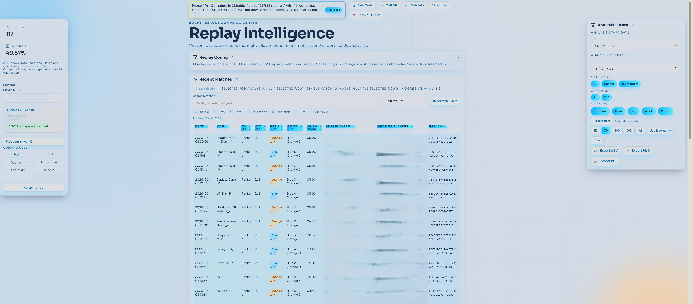

# RL Local Dashboard (V2)

Local Rocket League replay analytics dashboard.

It parses your `.replay` files locally, lets you lock onto your real `Player ID`, and turns your replay history into a searchable dashboard with charts, match analysis, and exports.

<p align="center">
  
</p>

## What It Can Do

- Load replays from your local Rocket League demos folder
- Parse them with `boxcars`
- Track you across old replays with a persistent `Player ID`
- Show a recent matches table with search, sorting, pagination, and row selection
- Display player-focused KPIs and timeline charts
- Compare you against mates and enemies
- Show boost, performance, distribution, and map win-rate analytics
- Open single-match analysis when exactly one row is selected
- Export data as CSV, PNG, and PDF
- Keep optional cache/raw replay outputs on disk

## Download

Latest runtime release:

- https://github.com/AloisTh1/RocketLeagueReplayDashboard/releases/tag/v2.0.2

## User Tutorial

### 1. Download And Extract

1. Download the latest runtime package from the release page.
2. Extract it somewhere on your machine.
3. Keep the packaged files together, especially the backend and `boxcars` binary.

### 2. Start The App

1. Launch the runtime package from the extracted release.
2. Open the dashboard in your browser.

### 3. Configure Your Replay Sources

In `Replay Config`, fill these first:

- `Demos directory`
- `Boxcars exe`

Typical Windows replay folder:

- `%USERPROFILE%\Documents\My Games\Rocket League\TAGame\Demos`

If you use the packaged release, point `Boxcars exe` to the bundled `boxcars.exe`.

### 4. First Parse

Recommended first run:

- keep `Quick load dates` on `7D`
- keep `Replay count` low for a fast smoke test
- leave cache disabled unless you want to keep parsed/raw files

Then click:

- `Load replays`

### 5. Pick Your Player ID

After parsing:

- use the player picker if it opens automatically
- or paste your `Player ID` manually

Analytics unlock only when a valid `Player ID` is matched.

### 6. Read The Dashboard

Once your player is matched:

- the left panel shows your tracked player and core KPIs
- the recent matches table lets you search and select games
- selecting exactly `1` row opens single-match analysis
- selecting `2+` rows keeps aggregate analysis, scoped to those rows
- the right panel lets you switch between analytics groups

### 7. Optional Cache Mode

If you enable `Write to cache`, you must also fill:

- `Cache directory`
- `Raw directory`

Then the app can:

- reuse cached parses
- store raw replay JSON
- open/clear those folders from the UI

## Replay Config Reference

- `Load replays` / `Stop parsing`: start or stop a parse run
- `Quick load dates`: shortcut date presets
- `Load start date` / `Load end date`: replay time filter window
- `Demos directory`: folder containing `.replay` files
- `Boxcars exe`: parser executable path
- `Write to cache`: enable cache/raw persistence
- `Cache directory` + `Raw directory`: required when cache mode is enabled
- `Replay count`: optional max replay count (`0` means no explicit limit)
- `Parse workers`: number of parser workers
- `Open cache folder`, `Open raw folder`, `Clear cache`: storage actions

Validation rules:

- parsing requires `Demos directory` and `Boxcars exe`
- if cache mode is enabled, both `Cache directory` and `Raw directory` are mandatory

## How The Analysis Works

- The replay table is available after replays are loaded
- Analytics stay hidden until a valid `Player ID` is matched
- No selected row: aggregate analysis over the current filtered dataset
- Exactly `1` selected row: single-match analysis
- `2+` selected rows: aggregate analysis over the selected rows

## Metrics And Exports

- Every main chart/control has tooltip help text
- `Stats Info` documents the metrics used in the UI
- Top KPI cards are:
  - `Replays`
  - `Win Rate`
- `Win Rate` is player-only
- Export actions:
  - `CSV`
  - `PNG`
  - `PDF`

## Developer

### Stack

- Backend: Python, FastAPI, Uvicorn
- Frontend: React, Vite, Recharts
- Replay parser: `boxcars`
- Packaging: PyInstaller + GitHub Actions

### Repository Layout

- [`backend/main.py`](backend/main.py): FastAPI endpoints and orchestration
- [`backend/replay.py`](backend/replay.py): replay parsing and stat derivation
- [`backend/cache.py`](backend/cache.py): cache index and file handling
- [`frontend/src/App.jsx`](frontend/src/App.jsx): main dashboard container
- [`docs/DATA_FIELDS.md`](docs/DATA_FIELDS.md): parsed fields and KPI inputs
- [`.github/workflows/release.yml`](.github/workflows/release.yml): semantic-release + Windows runtime ZIP upload

### Local Development

Backend:

```powershell
uv sync
uv run python -m uvicorn backend.main:app --host 0.0.0.0 --port 8000
```

Frontend:

```powershell
cd frontend
npm install
npm run dev -- --host --port 5173
```

### Build And Release

Frontend production build:

```powershell
cd frontend
npm run build
```

Ubuntu-compatible release script:

```bash
bash scripts/release.sh
```

GitHub release flow:

1. `push` to `main`
2. semantic-release computes/publishes the new version
3. if a new tag is created on remote `main`, the Windows packaging job runs
4. the workflow uploads `release-dist.zip`

The asset packaging step only runs for a newly created release tag. It does not reuse an older tag.
